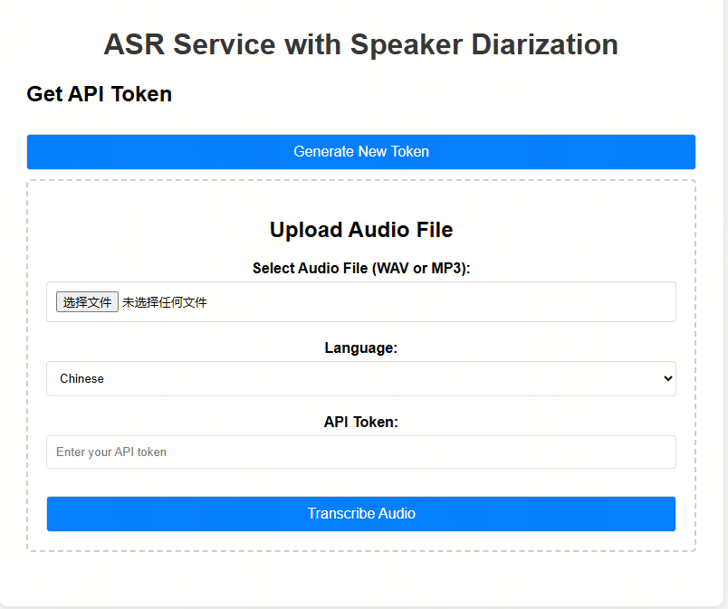

# ASR Service with Speaker Diarization

This project is an automatic speech recognition service based on Whisper, with added speaker diarization functionality.



## Features

- Speech-to-text (ASR)
- Multi-language support
- Speaker diarization
- RESTful API interface
- Web frontend for easy use
- Logging and auditing
- Prometheus monitoring metrics

## Installation

```bash
pip install -r requirements.txt
```

## Starting the Service

```bash
uvicorn main:app --host 0.0.0.0 --port 8000
```

## Usage

### Web Interface

After starting the service, visit `http://localhost:8000` in your browser to access the web interface. The interface has two main sections:

1. **Token Generation**: Click the "Generate New Token" button to obtain an API token for authentication.
2. **Audio Transcription**: Upload WAV or MP3 audio files and download the transcription results as JSON.

### API Endpoints

#### Get Access Token

```bash
curl -X POST http://localhost:8000/auth/token
```

#### Transcribe Audio

```bash
# Upload audio file
curl -X POST http://localhost:8000/transcribe \
  -H "Authorization: Bearer YOUR_TOKEN" \
  -F "file=@audio.wav" \
  -F "language=en"

# Or provide audio URL
curl -X POST http://localhost:8000/transcribe \
  -H "Authorization: Bearer YOUR_TOKEN" \
  -F "audio_url=http://example.com/audio.wav" \
  -F "language=en"
```

## Response Format

```json
{
  "language": "en",
  "segments": [
    {
      "start": 0.0,
      "end": 5.58,
      "text": "Hello, world.",
      "speaker": "SPEAKER0"
    },
    {
      "start": 5.58,
      "end": 10.25,
      "text": "The weather is nice today.",
      "speaker": "SPEAKER1"
    }
  ]
}
```

## Environment Variables

- `WHISPER_MODEL_PATH`: Path to the Whisper model
- `DIARIZATION_MODEL_PATH`: Path to the speaker diarization model (default: pyannote/speaker-diarization-3.1)
- `LOG_LEVEL`: Log level (default INFO)
- `API_TOKENS`: List of allowed API tokens (comma separated)

## Speaker Diarization

This project integrates the PyAnnote.audio library to implement speaker diarization functionality. When processing audio, the system automatically detects different speakers and assigns corresponding speaker labels to each transcription segment.