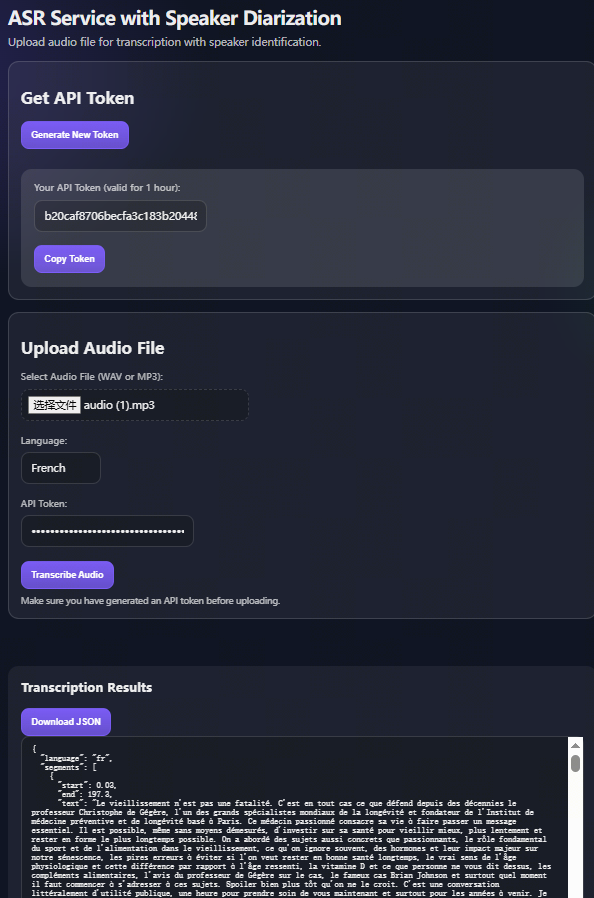
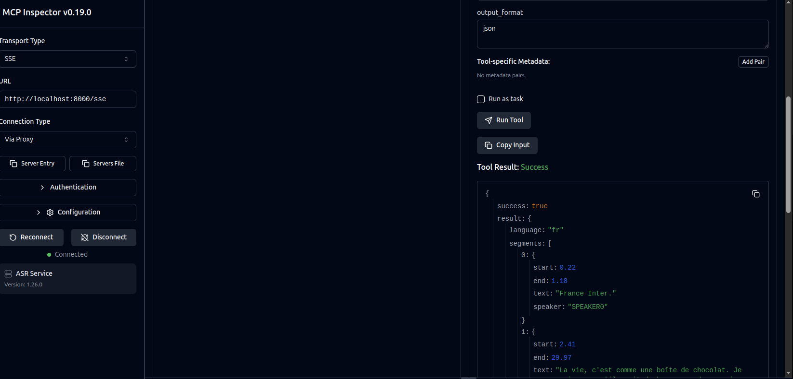

## InnoFrance ASR Service

Transcribe audio to text with Whisper and optional speaker diarization. Use the web service, CLI, or MCP server (stdio or SSE) for local or remote workflows.



### Key Features

- FastAPI service with web UI and JSON/form endpoints
- CLI for local transcription
- MCP server for LLM workflows (stdio or SSE transport)
- Speaker diarization with PyAnnote when available
- Prometheus metrics, logging, and audit trail

### Requirements

- Python 3.10+
- `ffmpeg` installed and available on PATH
- GPU recommended for large models (CPU is supported but slow)

Install ffmpeg on Ubuntu/Debian:

```bash
sudo apt update
sudo apt install -y ffmpeg
```

### Setup

```bash
python3 -m pip install -r requirements.txt
```

Environment variables are optional. A sample file is provided:

```bash
cp env.example .env
```

### Run the Web Service

```bash
python3 -m uvicorn app.main:app --host 0.0.0.0 --port 8000 --reload
```

Open `http://localhost:8000`.

### Web UI

- Generate an access token.
- Upload an audio file or provide an audio URL.
- Download JSON output with timestamps and speaker labels.

### API Usage (curl)

Get an access token:

```bash
curl -X POST http://localhost:8000/auth/token
```

Transcribe an upload:

```bash
curl -X POST http://localhost:8000/transcribe \
  -H "Authorization: Bearer YOUR_TOKEN" \
  -F "file=@/path/to/audio.mp3" \
  -F "language=en" \
  -F "chunk_length=30"
```

Transcribe from URL:

```bash
curl -X POST http://localhost:8000/transcribe \
  -H "Authorization: Bearer YOUR_TOKEN" \
  -F "audio_url=https://example.com/audio.mp3" \
  -F "language=en" \
  -F "chunk_length=30"
```

### CLI Usage

```bash
# Basic usage - transcribe audio file
python3 -m app.cli /path/to/audio.mp3

# Specify language
python3 -m app.cli /path/to/audio.mp3 --language en

# Output plain text
python3 -m app.cli /path/to/audio.mp3 --format text

# Save output to file
python3 -m app.cli /path/to/audio.mp3 --output transcription.json

# Adjust chunk size in seconds
python3 -m app.cli /path/to/audio.mp3 --chunk-length 60
```

CLI options:
- `--language`, `-l`: Language code for transcription (default: fr)
- `--chunk-length`, `-c`: Chunk length in seconds (default: 30)
- `--output`, `-o`: Output file path. If not specified, prints to stdout
- `--format`, `-f`: Output format (json or text)

### MCP Server (stdio)

```bash
python3 -m app.mcp_server
```

Add to your MCP client configuration:

```json
{
  "mcpServers": {
    "asr-service": {
      "command": "python3",
      "args": ["-m", "app.mcp_server"]
    }
  }
}
```

### MCP Server (SSE)

```bash
python3 -m app.mcp_server --transport sse --host 0.0.0.0 --port 8000
```

Use your MCP client to connect to the server host and port. The exact SSE endpoints are managed by FastMCP, and the host/port are configured when FastMCP is initialized.



### MCP Tools

- `transcribe_audio(audio_path, language="fr", chunk_length=30, output_format="json")`
- `transcribe_audio_from_url(audio_url, language="fr", chunk_length=30, output_format="json")`
- `transcribe_and_save(audio_path, output_path, language="fr", chunk_length=30, output_format="json")`

### Response Format

```json
{
  "language": "en",
  "segments": [
    {
      "start": 0.0,
      "end": 5.58,
      "text": "Hello, world.",
      "speaker": "SPEAKER0"
    }
  ]
}
```

### Environment Variables

`env.example` lists all supported environment variables and sample values.

- `WHISPER_MODEL_PATH`: Whisper model path (default: `openai/whisper-large-v3`)
- `DIARIZATION_MODEL_PATH`: Speaker diarization model path (default: `pyannote/speaker-diarization-3.1`)
- `LOG_LEVEL`: `DEBUG|INFO|WARNING|ERROR` (default `INFO`)
- `API_TOKENS`: Optional allowlist of tokens (comma separated)
- `MAX_AUDIO_MB`: Maximum upload size in MB (default `200`)

### Speaker Diarization

If the diarization model is available, segments include a `speaker` field. If diarization is unavailable, the service assigns `SPEAKER0` to all segments.

### Verification (single-node)

Use the provided test file:

```bash
TEST_AUDIO="/tmp/yt-extract-fj0f8rn3/Behind the Scenes Grizzlies  Runway.mp3"

# CLI
python3 -m app.cli "$TEST_AUDIO" --language en --format text

# MCP stdio
python3 -m app.mcp_server
```

For MCP stdio, invoke `transcribe_audio` with `audio_path` set to the same `TEST_AUDIO` path.

### Docker (optional)

```bash
cd docker
./start.sh
```

### Project Layout

```
InnoFranceASRService/
├── app/
│   ├── main.py
│   ├── asr_service.py
│   ├── auth.py
│   ├── config.py
│   ├── logger.py
│   ├── metrics.py
│   ├── s3.py
│   ├── cli.py
│   ├── mcp_server.py
│   ├── static/
│   └── templates/
├── docker/
├── doc/
├── requirements.txt
└── README.md
```